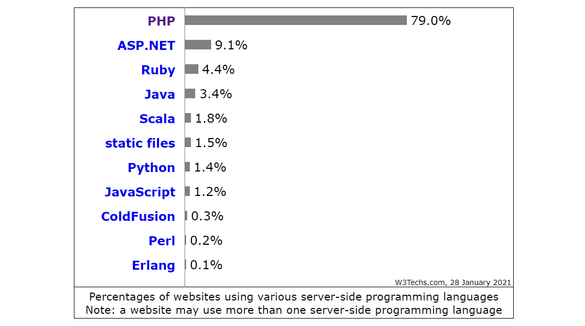

# PHP


PHP (acrónimo recursivo de PHP: Hypertext Preprocessor) es uno de los lenguajes de programación y scripting del lado del servidor más utilizados. Es de código abierto y se utiliza principalmente para el desarrollo web.



```php
<?php
    phpinfo();
>
```

## instalar PHP

Para instalar PHP basta con instalar el paquete php, pero para utilizarlo junto con apache y mysql además es necesario instalar los módulos para ello.

`sudo apt install php libapache2-mod-php php-mysql`

## Iniciar Servidor

php -S localhost:4000
Inicia un servidor nuevo en localhost y escucha en el puerto 4000

### Soporte de MySQL

Para tener soporte de MySQL en PHP deberemos

instalar el paquete php7.0-mysql
– $ apt-cache search php7.0
(es necesario reiniciar Apache)

### Ver información de instalación PHP

php -r "phpinfo();" > nombreArchivo
Lo vuelca en un archivo

## Paradigmas de Programación

PHP es un lenguaje flexible y dinámico que permite usar una variedad de técnicas de programación. El lenguaje ha evolucionado dramáticamente a través de los años. Se añadió un modelo de objetos (object-oriented) sólido en la versión 5.0 (2004), funciones anónimas y espacios de nombres (namespaces) en PHP 5.3, y rasgos (traits) en PHP 5.4 (2012).
Programación Orientada a Objetos

PHP tiene un conjunto muy completo de aspectos que facilitan la programación orientada a objetos (OOP) que incluye la habilidad de crear clases, clases abstractas, interfaces, herencia, constructores, clonación de objetos, excepciones y mucho más.

### Programación Funcional

PHP tiene la capacidad de declarar funciones de primera clase, en otras palabras, una función puede ser asignada a un variable. Las funciones definidas por el usuario, así como las funciones internas (incluidas), tiene la habilidad de ser referenciadas por un variable e invocadas dinámicamente. Las funciones pueden ser pasadas como argumentos a otras funciones (un aspecto llamado funciones de orden superior) y funciones pueden devolver otras funciones.

La recursividad es un aspecto que le permite a una función a llamarse a sí misma. El lenguaje PHP habilita este tipo de algoritmos, sin embargo, la mayoría del código PHP se enfoca en iteración.

Las funciones anónimas (con soporte para closures) están presentes en PHP desde la versión 5.3 (2009).

En PHP 5.4 se añadió la habilidad para vincular closure al ámbito de un objeto y también se mejoró el soporte de funciones de tipo callable para que puedan intercambiarse con funciones anónimas en casi todos los casos.

### Programación Meta

PHP soporta varias formas de programación meta por medio de mecanismos como el API de Reflexión y los Métodos Mágicos. Hay muchos Métodos Mágicos disponibles como __get(), __set(), __clone(), __toString(), __invoke() y más, que permiten a los desarrolladores a conectarse con el funcionamiento de la clase. A menudo desarrolladores en Ruby dicen que a PHP le falta la función de method_missing, sin embargo los aspectos de esta función están disponibles en __call() y __callStatic().

### Namespaces

La comunidad de PHP tiene muchos desarrolladores creando una gran cantidad de código fuente. Esto quiere decir que existe la posibilidad que dos librerías diferentes utilicen el mismo nombre para una clase en su código. Cuando las dos librerías se usan dentro del mismo namespace esto se denomina como una colisión y puede causar problemas.

Los Namespaces resuelven este problema. Como se describe en el manual de referencia de PHP, los namespaces son similares a los directorios que separan los archivos en el sistema operativo. Dos archivos con el mismo nombre pueden coexistir en directorios separados. Igualmente, dos clases de PHP con el mismo nombre pueden coexistir en namespaces separados, es tan simple como eso.

Es importante que separe su código con un namespace para que pueda ser usado por otros desarrolladores sin la preocupación de que cause conflictos con otras librerías.

Uno de los métodos recomendados para el uso de espacios de nombres se indica en el PSR-0, el cual se propone proveer una convención estándar para los archivos, clases y los namespaces, lo cual facilita el intercambio y uso del código en diferentes proyectos.

### Librería Estándar de PHP

La Librería Estándar de PHP (SPL) viene empaquetada con PHP y provee una colección de clases e interfaces compuesta principalmente de clases de estructura de datos (como stack, queue y heap) e iteradores que pueden atravesar estas estructuras de datos o sus propias clases que implementan las interfaces de la SPL.

### Interface de Línea de Comando (CLI)

PHP fue creado principalmente para desarrollar aplicaciones web, pero también es muy útil para implementar programas que corren en la interface de línea de comando (CLI). Los programas de línea de comando en PHP pueden ayudarle a automatizar tareas comunes como pruebas, despliegues y la administración de aplicaciones.

Los programas CLI en PHP son muy potentes porque el código de la aplicación se puede utilizar directamente sin tener que crear o asegurar un GUI web para su uso. Por esta razón, ¡asegúrese de no colocar sus programas CLI en su directorio raíz público!

Intente correr PHP desde la línea de comando:

> php -i

La opción -i imprimirá la configuración de PHP, como sucede con la función phpinfo. La opción -a habilita una consola interactiva muy similar al IRB de Ruby o a la consola interactiva de Python. Existen varias opciones de línea de comando que resultan muy útiles. Vamos a escribir un programa simple que imprima “Hola, $nombre” a la línea de comando. Para empezar, vamos a crear un archive llamad hola.php como se muestra enseguida:

```php
<?php
if($argc != 2) {
    echo "Uso: php hola.php [nombre].\n";
    exit(1);
}
$nombre = $argv[1];
echo "Hola, $nombre\n";
```

PHP hace disponibles dos variables especiales basados en los argumentos que recibe el programa el ser ejecutado. El variable de tipo entero $argc contiene el count o número de argumentos y el variable de tipo array "$argv" contiene el value o valor de cada uno de los argumentos que se pasaron durante la ejecución. El primer argumento siempre es el nombre del archivo del programa PHP, que en este caso es `hola.php`.

La expresión `exit()` se puede usar con un número que no es cero para dejarle saber a la consola que el comando ha fallado. [Aquí](http://www.gsp.com/cgi-bin/man.cgi?section=3&topic=sysexits) puede encontrar los códigos de salida más comúnmente usados.

Para ejecutar el programa desde la línea de comando:

> php hola.php
Uso: php hola.php [nombre]
> php hola.php mundo
Hola, mundo

## XDebug

Es una de las herramientas más útiles en el desarrollo de software, es un depurador o debugger. Permite el trazado de ejecución de tu código y monitorear el contenida de la pila de ejecución. XDebug, depurador para PHP, puede ser utilizado por varios IDEs para proveer Breakpoints e inspeccionar la pila de ejecución. También permite que herramientas como PHPUnit y KCacheGrind realicen análisis de cobertura del código.

Si te encuentras en un aprieto, y recurres a var_dump/print_r, y sigues sin encontrar la solución - tal ves necesitas usar un depurador.

Instalar XDebug puede ser complicado, pero una de las características más importantes es la “Depuración Remota” - Si ésta desarrollando su código localmente y después lo prueba dentro de una VM (Máquina Virtual) u en otro servidor, la Depuración Remota es la característica que necesitaras habilitar desde un comienzo.

Tradicionalmente, tendrá que modificar su VHost Apache o el archivo .htaccess con los siguientes valores:

php_value xdebug.remote_host=192.168.?.?
php_value xdebug.remote_port=9000

El “remote host” y el “remote port” corresponderán a su computadora local y el puerto de escucha que usted configuró para su IDE. Ahora solo es cuestión de que ponga su IDE dentro del modo “escuchar conexiones”, y cargue la URL:

http://your-website.example.com/index.php?XDEBUG_SESSION_START=1

Su IDE ahora interceptará el estado actual de la ejecución de su script, permitiéndole establecer breakpoints y verificar los valores en memoria.

Los depuradores gráficos hacen muy fácil el proceso de recorrer el código, inspeccionar variables, y evaluar el código en tiempo de ejecución. Varios IDE’s tienen integrado o pueden ser integrados vía plugin la depuración gráfica con XDebug. MacGDBp es un GUI de XDebug para Mac y también es gratuito, open-source y stand-alone.

## Enlaces

- [Estadísticas de Internet](https://w3techs.com/)
- [PHP - La Manera Correcta](https://phptherightway.com/)